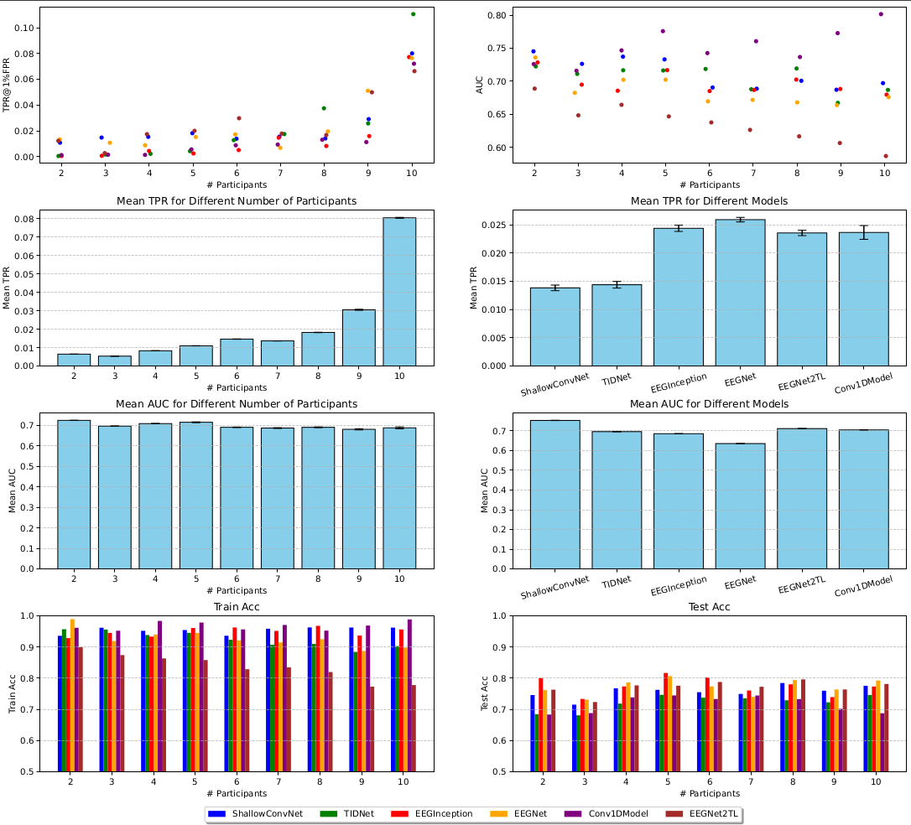
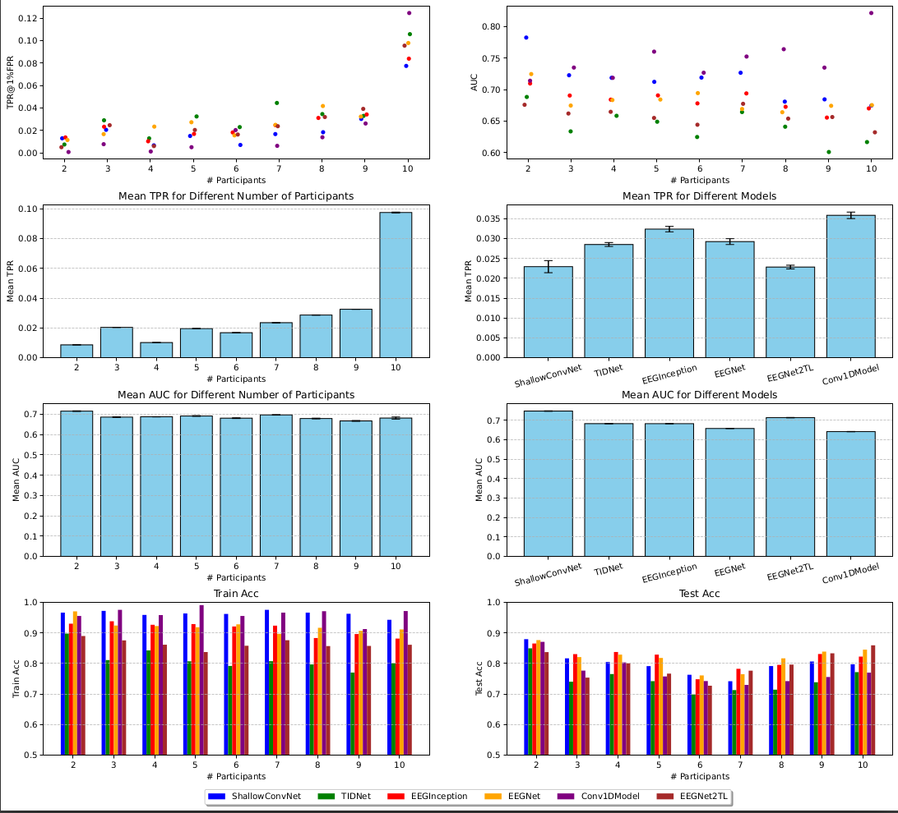

## Investigating Membership Inference Attacks against CNN Models for BCI Systems

Models (from the model.py and Braindecode library [[1]](#1)[[2]](#2)) parameters used in the experiments: 

```python
from model import EEGNet2TL, Conv1DModel
from braindecode.models import TIDNet, ShallowFBCSPNet, EEGInceptionERP, EEGNetv4
models = {
    "ShallowConvNet": [ShallowFBCSPNet, {
        "n_chans": n_chans,
        "n_outputs": n_outputs,
        "n_times": n_times,
        "n_filters_time": 48,
        "filter_time_length": 25,
        "n_filters_spat": 40,
        "pool_time_length": 25,
        "pool_time_stride": 5,
        "final_conv_length": "auto",
        "conv_nonlin": nn.functional.relu,
        "pool_mode": "mean",
        "pool_nonlin": nn.functional.relu,
        "split_first_layer": True,
        "batch_norm": True,
        "batch_norm_alpha": 0.1,
        "drop_prob": 0.2,
        "add_log_softmax": False,
    }],
    "TIDNet": [TIDNet, {
        "n_chans": n_chans,
        "n_outputs": n_outputs,
        "n_times": n_times,
        "s_growth": 16,
        "t_filters": 12,
        "drop_prob": 0.2,
        "pooling": 15,
        "temp_layers": 2,
        "spat_layers": 1,
        "temp_span": 0.05,
        "bottleneck": 3,
        "summary": -1,
        "add_log_softmax": False,
    }],
    "EEGInception": [EEGInceptionERP, {
        "n_chans": n_chans,
        "n_outputs": n_outputs,
        "n_times": n_times,
        "sfreq": downsampled_freq,
        "drop_prob": 0.2,
        "scales_samples_s": (0.4, 0.2, 0.1),
        "n_filters": 8,
        "activation": nn.ELU(),
        "batch_norm_alpha": 0.01,
        "depth_multiplier": 2,
        "pooling_sizes": (4, 2, 2, 2),
        "add_log_softmax": False,
    }],
    "EEGNet": [EEGNetv4, {
        "n_chans": n_chans,
        "n_outputs": n_outputs,
        "n_times": n_times,
        "final_conv_length": "auto",
        "pool_mode": "mean",
        "F1": 32,
        "D": 3,
        "F2": 64,
        "kernel_length": 64,
        "third_kernel_size": (8, 4),
        "drop_prob": 0.2,
        "add_log_softmax": False
    }],
    "Conv1DModel": [Conv1DModel, [
        {"in_channels": 4, "out_channels": 32, "kernel_size": 64, "stride": 1, "padding": 0, "dilation": 1, "groups": 4, "drop_prob": 0.2},
        {"in_channels": 32, "out_channels": 32, "kernel_size": 32, "stride": 1, "padding": 0, "dilation": 1, "groups": 32, "drop_prob": 0.2},
        {"in_channels": 32, "out_channels": 14, "kernel_size": 16, "stride": 1, "padding": 0, "dilation": 1, "groups": 1, "drop_prob": 0.2},
    ]],
    "EEGNet2TL": [EEGNet2TL, {
        'receptive_field': 32,
        'D': 2,
        'separable': True,
        "drop_prob": 0.2,
        'filter_sizing': 16,
        'sep_kernel_size': 128,
        'pool_kernel_size2': 32,
        'pooling_overlap': 1,
        'nr_temp_layers': 2,
        'pooling_layer': True,
        'spatial_layer': True
    }],
}
```

Extra plots for visualizing results from table II.


Extra plots for visualizing results from table IV.


## References

<a id="1">[1]</a> Schirrmeister, R.T., Springenberg, J.T., Fiederer, L.D.J., Glasstetter, M., Eggensperger, K., Tangermann, M., Hutter, F., Burgard, W. and Ball, T., 2017. Deep learning with convolutional neural networks for EEG decoding and visualization. Human brain mapping, 38(11), pp.5391-5420.

<a id="2">[2]</a> Gramfort, A., Luessi, M., Larson, E., Engemann, D.A., Strohmeier, D., Brodbeck, C., Goj, R., Jas, M., Brooks, T., Parkkonen, L. and Hämäläinen, M., 2013. MEG and EEG data analysis with MNE-Python. Frontiers in Neuroinformatics, 7, p.267.
